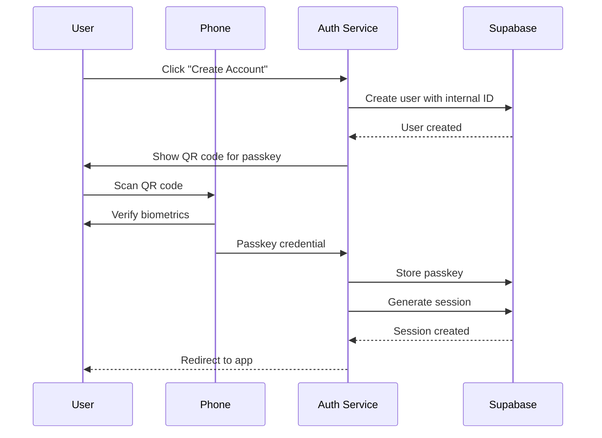
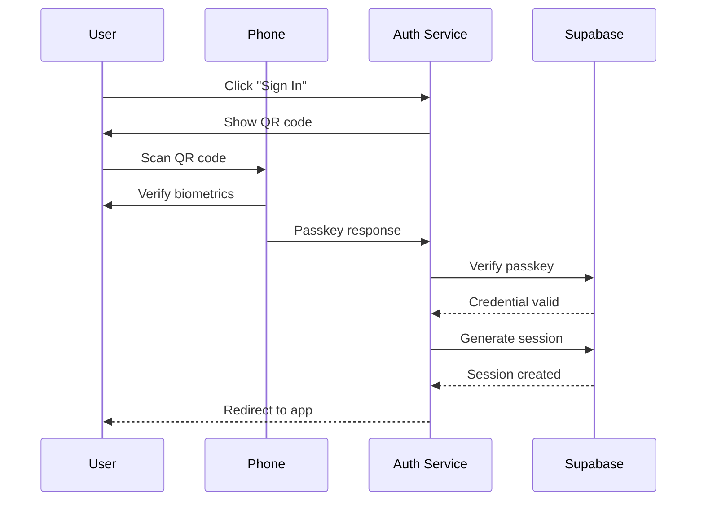

# Helvety Auth

Centralized authentication service for the Helvety ecosystem, providing passwordless SSO across all Helvety applications.

## Overview

Helvety Auth (`auth.helvety.com`) handles all authentication for Helvety applications:
- **helvety.com** - Main website
- **store.helvety.com** - Store application
- **pdf.helvety.com** - PDF application

## Features

- **Passkey-Only Authentication** - No passwords or emails required
- **Zero Personal Data** - Accounts use only internal identifiers, no email collection
- **WebAuthn/FIDO2** - Secure authentication via phone (QR code + biometrics)
- **Cross-Subdomain SSO** - Single sign-on across all `*.helvety.com` apps
- **Redirect URI Support** - Seamless cross-app authentication flows

## Tech Stack

- **Framework**: Next.js 16 (App Router)
- **Language**: TypeScript
- **Authentication**: Supabase Auth + SimpleWebAuthn
- **Styling**: Tailwind CSS 4 + shadcn/ui
- **Deployment**: Vercel

## Authentication Flows

Authentication is **passkey-only** — no email address is required. Users authenticate using their device's biometrics (Face ID, fingerprint, or PIN) via WebAuthn.

### New User Flow (Create Account)



### Returning User Flow (Sign In)



### Key Points

- **No email required** - Users never provide an email address
- **Internal identifiers** - Accounts use UUIDs (`user_{uuid}@helvety.internal`) internally
- **Stripe handles purchase data** - Email/name/address collected by Stripe during checkout, not by Helvety

## Project Structure

```
helvety-auth/
├── app/
│   ├── actions/
│   │   └── passkey-auth-actions.ts  # WebAuthn passkey operations
│   ├── auth/
│   │   └── callback/
│   │       └── route.ts             # Magic link & OAuth callback handler
│   ├── login/
│   │   └── page.tsx                 # Login page with passkey-only flow
│   ├── logout/
│   │   └── route.ts                 # Logout with redirect support
│   ├── layout.tsx                   # Root layout with providers
│   └── page.tsx                     # Redirects to /login
├── components/
│   ├── auth-stepper.tsx             # Visual progress indicator
│   ├── auth-token-handler.tsx       # Client-side hash token handler
│   ├── navbar.tsx                   # Navigation bar
│   ├── app-switcher.tsx             # Cross-app navigation
│   └── ui/                          # shadcn/ui components
├── lib/
│   ├── crypto/
│   │   └── passkey.ts               # WebAuthn browser support detection
│   ├── supabase/
│   │   ├── admin.ts                 # Admin client (service role)
│   │   ├── client.ts                # Browser client
│   │   └── server.ts                # Server-side client
│   ├── types/
│   │   ├── entities.ts              # Database entity types
│   │   └── index.ts                 # Type exports
│   ├── env-validation.ts            # Environment variable validation
│   ├── logger.ts                    # Logging utility
│   └── utils.ts                     # General utilities
└── public/                          # Static assets
```

## API Routes

### GET `/auth/callback`

Handles authentication callbacks from magic links and OAuth flows.

**Query Parameters:**
- `code` - PKCE authorization code
- `token_hash` - Email OTP token hash
- `type` - OTP type (magiclink, signup, recovery, invite, email_change)
- `redirect_uri` - Where to redirect after authentication

### GET `/logout`

Signs out the user and redirects.

**Query Parameters:**
- `redirect_uri` - Where to redirect after logout (default: helvety.com)

**Example:** `/logout?redirect_uri=https://pdf.helvety.com`

## Cross-App Authentication

Other Helvety apps redirect to auth.helvety.com for authentication:

```typescript
// In store.helvety.com or pdf.helvety.com
import { getLoginUrl } from "@/lib/auth-redirect";

// Redirect unauthenticated users
const loginUrl = getLoginUrl(window.location.href);
window.location.href = loginUrl;
// → https://auth.helvety.com/login?redirect_uri=https://store.helvety.com/dashboard
```

After authentication, users are redirected back to their original app with an active session (shared via `.helvety.com` cookie domain).

## Database Schema

The service uses a `user_auth_credentials` table for storing WebAuthn credentials:

```sql
CREATE TABLE user_auth_credentials (
  id UUID PRIMARY KEY DEFAULT gen_random_uuid(),
  user_id UUID NOT NULL REFERENCES auth.users(id) ON DELETE CASCADE,
  credential_id TEXT NOT NULL UNIQUE,
  public_key TEXT NOT NULL,
  counter BIGINT NOT NULL DEFAULT 0,
  transports TEXT[] DEFAULT '{}',
  device_type TEXT,
  backed_up BOOLEAN DEFAULT FALSE,
  last_used_at TIMESTAMPTZ,
  created_at TIMESTAMPTZ DEFAULT NOW()
);
```

## Security Considerations

- **httpOnly Cookies** - Challenge storage uses secure httpOnly cookies
- **PKCE Flow** - Supabase uses PKCE for OAuth code exchange
- **Passkey Verification** - Strict origin and RP ID validation
- **Session Cookies** - Shared across subdomains via `.helvety.com` domain
- **Counter Tracking** - Prevents passkey replay attacks

## Developer

This application is developed and maintained by [Helvety](https://helvety.com), a Swiss company committed to transparency, strong security, and respect for user privacy and data protection.

For questions or inquiries, please contact us at [contact@helvety.com](mailto:contact@helvety.com).

## License & Usage

This repository is public for transparency purposes only. All code is open for inspection so users can verify its behavior.

**All Rights Reserved.** No license is granted. You may view the code, but you may not copy, reuse, redistribute, modify, or sell it without explicit written permission.

See [LICENSE](./LICENSE) for full terms.
