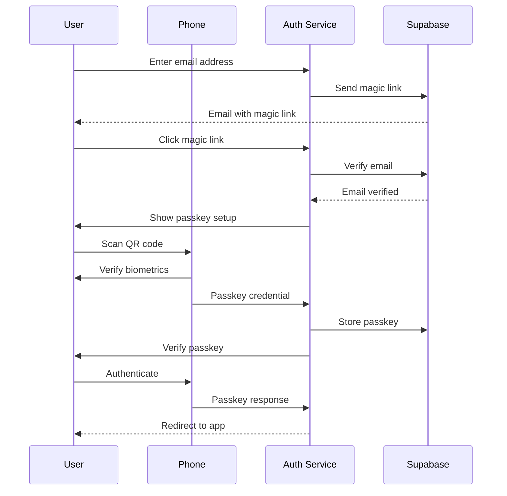
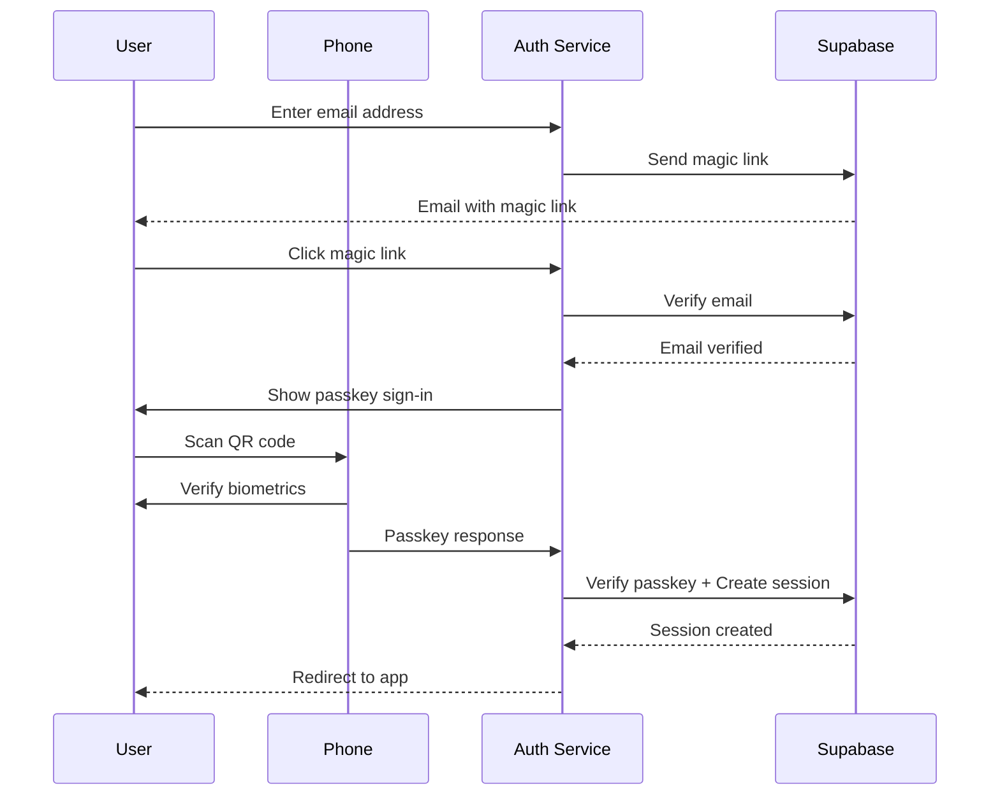

# Helvety Auth

Centralized authentication service for the Helvety ecosystem, providing passwordless SSO across all Helvety applications.

## Overview

Helvety Auth (`auth.helvety.com`) handles all authentication for Helvety applications:

- **helvety.com** - Main website
- **store.helvety.com** - Store application
- **pdf.helvety.com** - PDF application

## Features

- **Email + Passkey Authentication** - Secure two-factor flow with magic links and biometrics
- **WebAuthn/FIDO2** - Secure passkey authentication via phone (QR code + biometrics)
- **Cross-Subdomain SSO** - Single sign-on across all `*.helvety.com` apps
- **Redirect URI Support** - Seamless cross-app authentication flows

## Tech Stack

- **Framework**: Next.js 16 (App Router)
- **Language**: TypeScript
- **Authentication**: Supabase Auth + SimpleWebAuthn
- **Styling**: Tailwind CSS 4 + shadcn/ui
- **Testing**: Vitest
- **Deployment**: Vercel

## Authentication Flows

Authentication uses a secure two-step process: email verification via magic link, followed by passkey authentication.

### New User Flow



### Returning User Flow



Note: Passkey authentication creates the session directly server-side (via `verifyOtp`) without requiring the user to navigate through an additional callback URL. This ensures reliable session creation regardless of browser PKCE support.

### Key Points

- **Email required** - Users provide an email address for authentication and account recovery
- **Magic link verification** - Email confirmation before passkey authentication
- **Passkey security** - Biometric verification (Face ID, fingerprint, or PIN) via WebAuthn

## API Routes

### GET `/auth/callback`

Handles authentication callbacks from email magic links and OAuth flows. After successful email verification, redirects to the login page with the appropriate passkey step.

**Note:** This route is NOT used for passkey sign-in. Passkey authentication creates the session directly server-side and redirects the user to their destination without going through this callback.

**Query Parameters:**

- `code` - PKCE authorization code
- `token_hash` - Email OTP token hash
- `type` - OTP type (magiclink, signup, recovery, invite, email_change)
- `redirect_uri` - Where to redirect after authentication (validated against allowlist)

**Behavior:**

- Verifies the magic link token (via code exchange or OTP verification)
- Checks if user has a passkey and encryption configured
- Redirects based on user status:
  - New users or missing encryption: `/login?step=encryption-setup`
  - Returning users after email verification: `/login?step=passkey-signin`
- If no `redirect_uri` is provided, defaults to `https://helvety.com`
- **Always preserves `redirect_uri`** through the entire auth flow, including when handling hash fragment authentication (where tokens arrive as `#access_token=...` instead of query params)

### GET `/logout`

Signs out the user and redirects.

**Query Parameters:**

- `redirect_uri` - Where to redirect after logout (default: helvety.com)

**Example:** `/logout?redirect_uri=https://pdf.helvety.com`

## Session Management (proxy.ts)

The `proxy.ts` middleware handles session refresh and cross-subdomain cookie management:

- **Session Refresh** - Automatically refreshes Supabase auth sessions on every request before they expire
- **Cross-Subdomain SSO** - Sets cookies with `.helvety.com` domain in production for session sharing across all Helvety apps
- **Server Component Support** - Ensures server components always have access to fresh session data

The middleware runs on all routes except static assets and handles the Supabase session lifecycle transparently.

## Cross-App Authentication

Other Helvety apps redirect to auth.helvety.com for authentication:

```typescript
// In store.helvety.com or pdf.helvety.com
// Each app has its own lib/auth-redirect.ts with helper functions

// Example redirect for unauthenticated users
const currentUrl = window.location.href;
const loginUrl = `https://auth.helvety.com/login?redirect_uri=${encodeURIComponent(currentUrl)}`;
window.location.href = loginUrl;
// → https://auth.helvety.com/login?redirect_uri=https://store.helvety.com/account
```

After authentication, users are redirected back to their original app with an active session (shared via `.helvety.com` cookie domain).

## Database Schema

The service uses two tables for storing WebAuthn credentials and encryption parameters:

### user_auth_credentials

Stores WebAuthn passkey credentials:

```sql
CREATE TABLE user_auth_credentials (
  id UUID PRIMARY KEY DEFAULT gen_random_uuid(),
  user_id UUID NOT NULL REFERENCES auth.users(id) ON DELETE CASCADE,
  credential_id TEXT NOT NULL UNIQUE,
  public_key TEXT NOT NULL,
  counter BIGINT NOT NULL DEFAULT 0,
  transports TEXT[] DEFAULT '{}',
  device_type TEXT,
  backed_up BOOLEAN DEFAULT FALSE,
  last_used_at TIMESTAMPTZ,
  created_at TIMESTAMPTZ DEFAULT NOW()
);
```

### user_passkey_params

Stores PRF extension parameters for encryption key derivation:

```sql
CREATE TABLE user_passkey_params (
  id UUID PRIMARY KEY DEFAULT gen_random_uuid(),
  user_id UUID NOT NULL REFERENCES auth.users(id) ON DELETE CASCADE,
  credential_id TEXT NOT NULL,
  prf_salt TEXT NOT NULL,
  created_at TIMESTAMPTZ DEFAULT NOW(),
  updated_at TIMESTAMPTZ DEFAULT NOW(),
  UNIQUE(user_id, credential_id)
);
```

**Note:** The `prf_salt` is used during PRF evaluation to derive the encryption key. The actual encryption key is never stored—it's derived client-side during passkey authentication.

## Security Considerations

- **httpOnly Cookies** - Challenge storage uses secure httpOnly cookies
- **PKCE Flow** - Supabase uses PKCE for OAuth code exchange
- **Magic Link Expiry** - Links expire after 1 hour
- **Passkey Verification** - Strict origin and RP ID validation
- **Session Cookies** - Shared across subdomains via `.helvety.com` domain
- **Counter Tracking** - Prevents passkey replay attacks
- **Redirect URI Validation** - All redirect URIs are validated against a strict allowlist to prevent open redirect attacks

### Security Hardening (Added Feb 2026)

The auth service implements comprehensive security hardening:

- **Rate Limiting** - Protection against brute force attacks:
  - Magic link requests: 3 per 5 minutes per email, 9 per 5 minutes per IP
  - Passkey authentication: 10 per minute per IP
  - Rate limits reset on successful authentication
- **CSRF Protection** - Token-based protection with timing-safe comparison for all state-changing Server Actions
- **Server Layout Guards** - Authentication checks in Server Components (CVE-2025-29927 compliant - auth NOT in proxy)
- **Audit Logging** - Structured logging for all authentication events:
  - Login attempts (success/failure)
  - Magic link sent/failed
  - Passkey authentication (started/success/failed)
  - Rate limit exceeded events
- **Standardized Errors** - Consistent error codes and user-friendly messages that don't leak implementation details
- **Security Headers** - CSP, HSTS, X-Frame-Options, and other security headers

### Redirect URI Validation

The auth service validates all `redirect_uri` parameters to prevent open redirect vulnerabilities. Allowed destinations:

- `https://helvety.com` and any path
- `https://*.helvety.com` - Any subdomain (dynamically supports future apps)
- `http://localhost:*` - Any port (development only)
- `http://127.0.0.1:*` - Any port (development only)

Invalid redirect URIs are rejected, and the user is redirected to `helvety.com` by default.

### End-to-End Encryption Setup

After passkey authentication, new users are guided through a two-step encryption setup:

**Step 1: Create Passkey (Registration)**
- User creates a passkey with their phone via QR code + biometrics
- The passkey is registered with the WebAuthn PRF extension enabled
- Server stores the credential and PRF salt parameters

**Step 2: Sign In with Passkey (Verification + Session)**
- User authenticates with the newly created passkey
- PRF extension derives a deterministic output from the passkey
- Client-side HKDF derives the encryption key from PRF output
- Server verifies the passkey response and creates a session
- User is redirected to destination app with valid session cookies

**Key Features:**
- **Encryption Passkey** - A passkey created using the WebAuthn PRF (Pseudo-Random Function) extension
- **Key Derivation** - Encryption keys are derived client-side from the PRF output using HKDF
- **Zero-Knowledge** - The server stores only PRF parameters (salt values); encryption keys are never transmitted
- **Cross-App Support** - Encryption passkeys work across all `*.helvety.com` apps (registered to `helvety.com` RP ID)

Browser requirements for encryption:

**Desktop:**
- Chrome 128+ or Edge 128+
- Safari 18+ on Mac
- Firefox 139+ (desktop only)

**Mobile:**
- iPhone with iOS 18+
- Android 14+ with Chrome

**Note:** Firefox for Android does not support the PRF extension.

**Legal Pages:** Privacy Policy, Terms of Service, and Impressum are hosted centrally on [helvety.com](https://helvety.com) and linked from the navbar.

## Developer

This application is developed and maintained by [Helvety](https://helvety.com), a Swiss company committed to transparency, strong security, and respect for user privacy and data protection.

For questions or inquiries, please contact us at [contact@helvety.com](mailto:contact@helvety.com).

## License & Usage

> **This is NOT open source software.**

This repository is public **for transparency purposes only** so users can verify the application's behavior and security.

**All Rights Reserved.** No license is granted for any use of this code. You may:
- View and inspect the code

You may NOT:
- Clone, copy, or download this code for any purpose
- Modify, adapt, or create derivative works
- Redistribute or share this code
- Use this code in your own projects
- Run this code locally or on your own servers

See [LICENSE](./LICENSE) for full legal terms.
