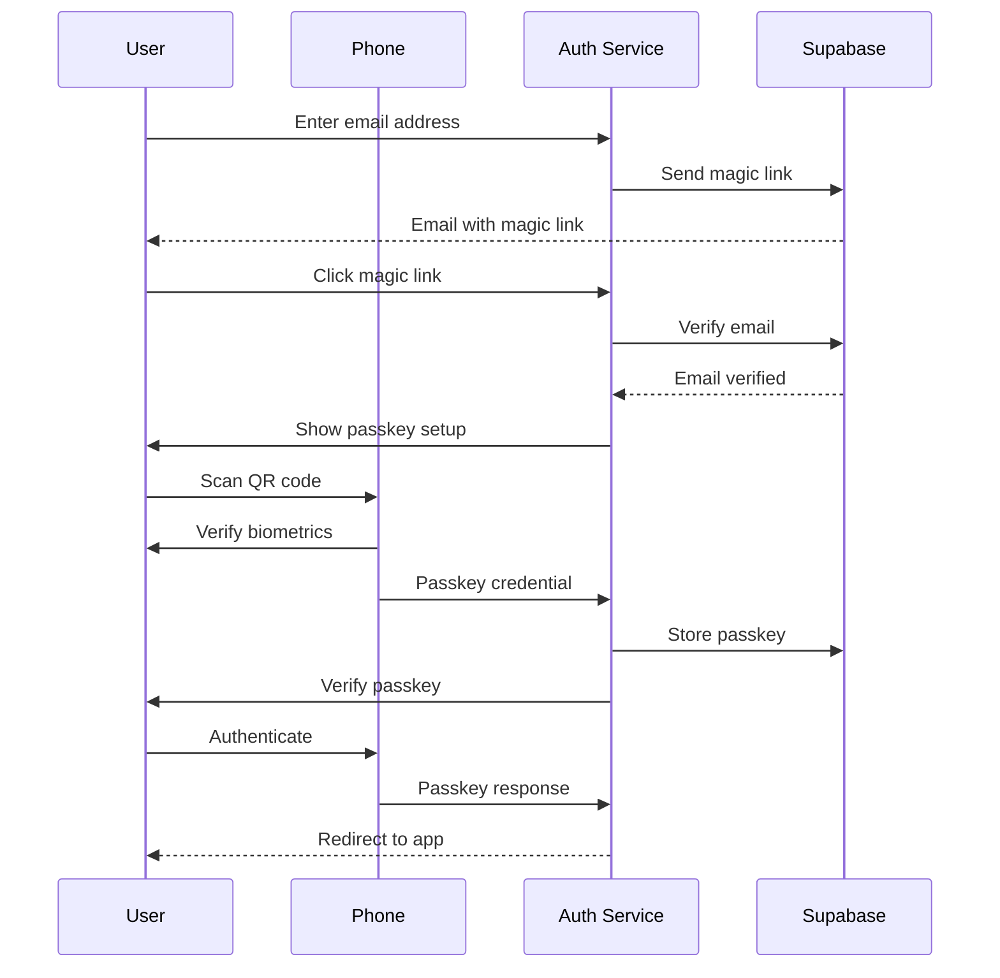
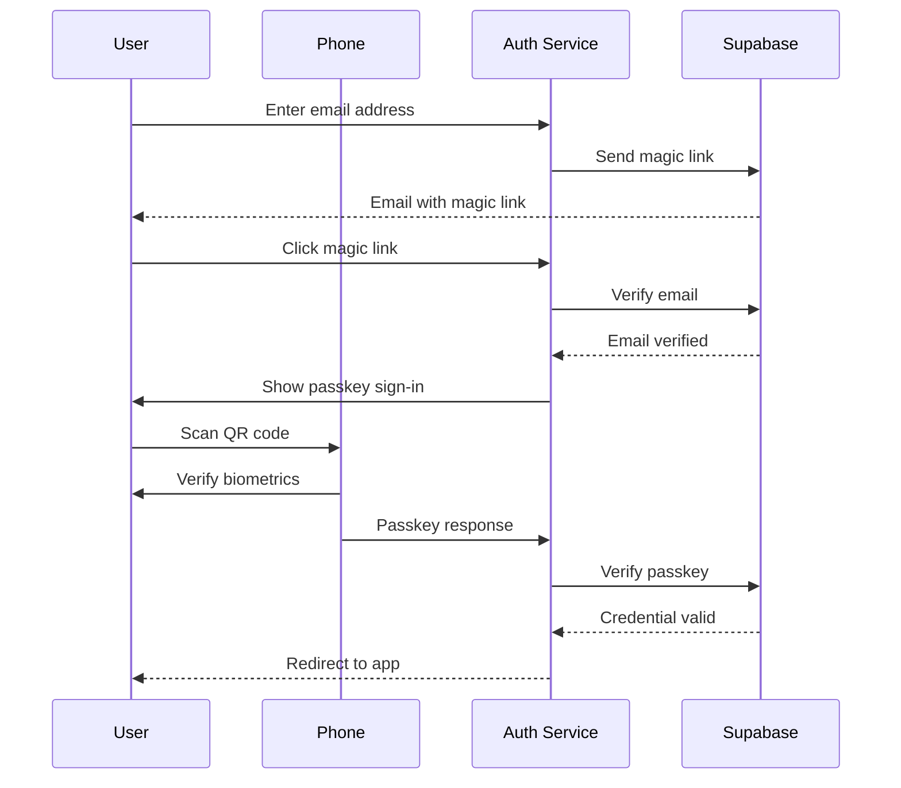

# Helvety Auth

Centralized authentication service for the Helvety ecosystem, providing passwordless SSO across all Helvety applications.

## Overview

Helvety Auth (`auth.helvety.com`) handles all authentication for Helvety applications:

- **helvety.com** - Main website
- **store.helvety.com** - Store application
- **pdf.helvety.com** - PDF application

## Features

- **Email + Passkey Authentication** - Secure two-factor flow with magic links and biometrics
- **WebAuthn/FIDO2** - Secure passkey authentication via phone (QR code + biometrics)
- **Cross-Subdomain SSO** - Single sign-on across all `*.helvety.com` apps
- **Redirect URI Support** - Seamless cross-app authentication flows

## Tech Stack

- **Framework**: Next.js 16 (App Router)
- **Language**: TypeScript
- **Authentication**: Supabase Auth + SimpleWebAuthn
- **Styling**: Tailwind CSS 4 + shadcn/ui
- **Testing**: Vitest + Playwright
- **Deployment**: Vercel

## Authentication Flows

Authentication uses a secure two-step process: email verification via magic link, followed by passkey authentication.

### New User Flow



### Returning User Flow



### Key Points

- **Email required** - Users provide an email address for authentication and account recovery
- **Magic link verification** - Email confirmation before passkey authentication
- **Passkey security** - Biometric verification (Face ID, fingerprint, or PIN) via WebAuthn

## Project Structure

```
helvety-auth/
├── __tests__/                       # Unit and integration tests
├── .github/
│   └── workflows/
│       └── test.yml                 # Automated testing
├── app/
│   ├── actions/
│   │   └── passkey-auth-actions.ts  # Magic link & WebAuthn passkey operations
│   ├── auth/
│   │   └── callback/
│   │       └── route.ts             # Magic link & OAuth callback handler
│   ├── login/
│   │   └── page.tsx                 # Login page with email + passkey flow
│   ├── logout/
│   │   └── route.ts                 # Logout with redirect support
│   ├── layout.tsx                   # Root layout with providers
│   └── page.tsx                     # Auth-aware redirect (prod→helvety.com, dev→login)
├── proxy.ts                         # Session refresh & cross-subdomain cookie handling
├── components/
│   ├── auth-stepper.tsx             # Visual progress indicator (Email → Verify → Passkey)
│   ├── auth-token-handler.tsx       # Client-side hash fragment token handler (for #access_token flows)
│   ├── encryption-setup.tsx         # Passkey + encryption setup wizard
│   ├── navbar.tsx                   # Navigation bar with profile menu
│   ├── app-switcher.tsx             # Cross-app navigation
│   └── ui/                          # shadcn/ui components
├── lib/
│   ├── crypto/
│   │   └── passkey.ts               # WebAuthn browser support detection
│   ├── supabase/
│   │   ├── admin.ts                 # Admin client (service role)
│   │   ├── client.ts                # Browser client
│   │   └── server.ts                # Server-side client
│   ├── types/
│   │   ├── entities.ts              # Database entity types
│   │   └── index.ts                 # Type exports
│   ├── auth-utils.ts                # Shared auth step detection utilities
│   ├── env-validation.ts            # Environment variable validation
│   ├── logger.ts                    # Logging utility
│   ├── redirect-validation.ts       # Redirect URI validation (dynamic subdomain support)
│   └── utils.ts                     # General utilities
├── e2e/                             # End-to-end tests (Playwright)
├── emails/                          # Supabase email templates
│   ├── confirmSignUp.html           # Email confirmation
│   ├── magicLink.html               # Magic link sign-in
│   ├── resetPassword.html           # Password/passkey recovery
│   ├── changeEmailAddress.html      # Email change confirmation
│   ├── inviteUser.html              # User invitation
│   └── reauthentication.html        # Re-authentication verification
├── public/                          # Static assets
├── vitest.config.ts                 # Vitest configuration
├── vitest.setup.ts                  # Test setup
└── playwright.config.ts             # Playwright E2E configuration
```

## API Routes

### GET `/auth/callback`

Handles authentication callbacks from magic links and OAuth flows. After successful email verification, redirects to the login page with the appropriate passkey step.

**Query Parameters:**

- `code` - PKCE authorization code
- `token_hash` - Email OTP token hash
- `type` - OTP type (magiclink, signup, recovery, invite, email_change)
- `redirect_uri` - Where to redirect after authentication (validated against allowlist)

**Behavior:**

- Verifies the magic link token (via code exchange or OTP verification)
- Checks if user has a passkey and encryption configured
- Redirects to `/login?step=encryption-setup` (new users or users without encryption) or `/login?step=passkey-signin` (existing users with encryption)
- **Always preserves `redirect_uri`** through the entire auth flow, including when handling hash fragment authentication (where tokens arrive as `#access_token=...` instead of query params)

### GET `/logout`

Signs out the user and redirects.

**Query Parameters:**

- `redirect_uri` - Where to redirect after logout (default: helvety.com)

**Example:** `/logout?redirect_uri=https://pdf.helvety.com`

## Cross-App Authentication

Other Helvety apps redirect to auth.helvety.com for authentication:

```typescript
// In store.helvety.com or pdf.helvety.com
// Each app has its own lib/auth-redirect.ts with helper functions

// Example redirect for unauthenticated users
const currentUrl = window.location.href;
const loginUrl = `https://auth.helvety.com/login?redirect_uri=${encodeURIComponent(currentUrl)}`;
window.location.href = loginUrl;
// → https://auth.helvety.com/login?redirect_uri=https://store.helvety.com/account
```

After authentication, users are redirected back to their original app with an active session (shared via `.helvety.com` cookie domain).

## Database Schema

The service uses a `user_auth_credentials` table for storing WebAuthn credentials:

```sql
CREATE TABLE user_auth_credentials (
  id UUID PRIMARY KEY DEFAULT gen_random_uuid(),
  user_id UUID NOT NULL REFERENCES auth.users(id) ON DELETE CASCADE,
  credential_id TEXT NOT NULL UNIQUE,
  public_key TEXT NOT NULL,
  counter BIGINT NOT NULL DEFAULT 0,
  transports TEXT[] DEFAULT '{}',
  device_type TEXT,
  backed_up BOOLEAN DEFAULT FALSE,
  last_used_at TIMESTAMPTZ,
  created_at TIMESTAMPTZ DEFAULT NOW()
);
```

## Getting Started

### Prerequisites

- Node.js 18.17 or later
- npm 9 or later
- A Supabase project (for authentication and database)

### Installation

1. Clone the repository:

   ```bash
   git clone https://github.com/helvety/helvety-auth.git
   cd helvety-auth
   ```

2. Install dependencies:

   ```bash
   npm install
   ```

3. Set up environment variables (see [Environment Variables](#environment-variables) below)

4. Run the development server:

   ```bash
   npm run dev
   ```

5. Open [http://localhost:3001](http://localhost:3001) in your browser (note: runs on port 3001 by default)

## Environment Variables

Copy `env.template` to `.env.local` and fill in the required values:

```bash
cp env.template .env.local
```

### Required Variables

| Variable | Description |
|----------|-------------|
| `NEXT_PUBLIC_SUPABASE_PROJECT_URL` | Your Supabase project URL |
| `NEXT_PUBLIC_SUPABASE_PUBLISHABLE_KEY` | Supabase anon/publishable key (safe for browser) |
| `SUPABASE_SECRET_KEY` | Supabase service role key (server-only, never expose to client) |

See `env.template` for the full list with descriptions.

## Configuration

### Supabase Setup

1. Create a new project at [supabase.com](https://supabase.com)
2. Run the database migrations to create the `user_auth_credentials` table (see [Database Schema](#database-schema))
3. Configure Row Level Security (RLS) policies for the credentials table
4. Set up email templates in the Supabase dashboard (see `emails/` directory for templates)
5. Configure the site URL to `https://auth.helvety.com` (or `http://localhost:3001` for development)

### Email Templates

Copy the HTML files from the `emails/` directory to your Supabase project's email templates:

- `confirmSignUp.html` - Email confirmation
- `magicLink.html` - Magic link sign-in
- `resetPassword.html` - Password/passkey recovery
- `changeEmailAddress.html` - Email change confirmation
- `inviteUser.html` - User invitation
- `reauthentication.html` - Re-authentication verification

## Security Considerations

- **httpOnly Cookies** - Challenge storage uses secure httpOnly cookies
- **PKCE Flow** - Supabase uses PKCE for OAuth code exchange
- **Magic Link Expiry** - Links expire after 1 hour
- **Passkey Verification** - Strict origin and RP ID validation
- **Session Cookies** - Shared across subdomains via `.helvety.com` domain
- **Counter Tracking** - Prevents passkey replay attacks
- **Redirect URI Validation** - All redirect URIs are validated against a strict allowlist to prevent open redirect attacks

### Redirect URI Validation

The auth service validates all `redirect_uri` parameters to prevent open redirect vulnerabilities. Allowed destinations:

- `https://helvety.com` and any path
- `https://*.helvety.com` - Any subdomain (dynamically supports future apps)
- `http://localhost:*` - Any port (development only)
- `http://127.0.0.1:*` - Any port (development only)

Invalid redirect URIs are rejected, and the user is redirected to `helvety.com` by default.

### End-to-End Encryption Setup

After passkey authentication, new users are guided to set up encryption:

- **Encryption Passkey** - A separate passkey is created using the WebAuthn PRF (Pseudo-Random Function) extension
- **Key Derivation** - Encryption keys are derived client-side from the PRF output using HKDF
- **Zero-Knowledge** - The server stores only PRF parameters (salt values); encryption keys are never transmitted
- **Cross-App Support** - Encryption passkeys work across all `*.helvety.com` apps (registered to `helvety.com` RP ID)

Browser requirements for encryption:

- Chrome 128+
- Edge 128+
- Safari 18+
- Firefox 139+ (desktop only)

**Note:** Firefox for Android does not support the PRF extension.

## Testing

This project uses Vitest for unit tests and Playwright for end-to-end tests.

```bash
# Run unit tests in watch mode
npm run test

# Run unit tests once
npm run test:run

# Run with coverage
npm run test:coverage

# Run E2E tests
npm run test:e2e

# Run E2E tests with UI
npm run test:e2e:ui
```

See `__tests__/README.md` for testing patterns and conventions.

## Developer

This application is developed and maintained by [Helvety](https://helvety.com), a Swiss company committed to transparency, strong security, and respect for user privacy and data protection.

For questions or inquiries, please contact us at [contact@helvety.com](mailto:contact@helvety.com).

## License & Usage

This repository is public for transparency purposes only. All code is open for inspection so users can verify its behavior.

**All Rights Reserved.** No license is granted. You may view the code, but you may not copy, reuse, redistribute, modify, or sell it without explicit written permission.

See [LICENSE](./LICENSE) for full terms.
